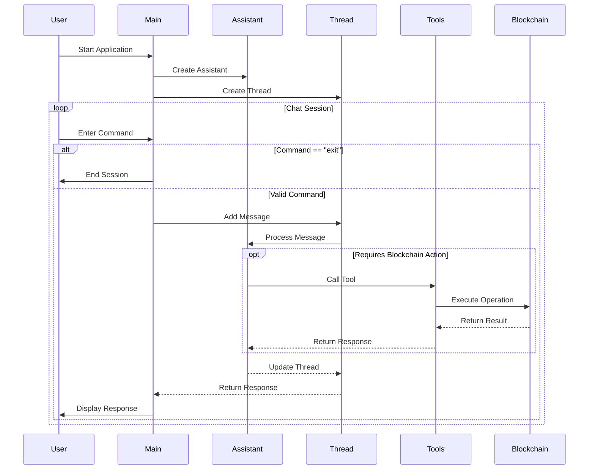

# PoXAgents - Framework to create AI agents for Stacks Blockchain

## Description

**PoXAgents** is a framework designed to interact with [Stacks Blockchain](https://www.stacks.co/) using AI Agents. It leverages OpenAI's models to provide a conversational interface for users to perform various blockchain operations, such as checking wallet balances, sending transactions, interact with STX, [sBTC](https://www.stacks.co/sbtc), and any other token (SIP10), and more. 

## What is the problem?
Blockchain networks have brought many new opportunities to millions (if not billions) of people, but the problem lies in the interaction, since Web3 has not managed to popularize such opportunities because it is complex to use for non-technical users (managing wallets, signing transactions, among others).

AI appears as an opportunity not only to reach non-technical users, but also to reduce the time and steps for each interaction, that is, to do a lot with few instructions.

## PoXAgents was born to solve this problem
There are already many frameworks designed to connect AI agents to Blockchain, but PoXAgents goes one step further, with the following features:
- Lightweight, with few dependencies needed.
- Focused on the Stacks ecosystem (it is extensible to any Stacks application in a few steps).
- Ability to execute several on-chain actions with a single instruction (for example: "check the sBTC balance and if you have more than 0.1, send 0.001 to ....").

## Mode
For now, PoXAgents works in a CLI mode, in the future, it will be available to integrate in other platforms, such as messaging.

## Demo

Video: https://www.youtube.com/watch?v=TrCm9arUl5k


## Features

- **Conversational Interface**: Engage with the assistant to perform blockchain operations through natural language.
- **Wallet Operations**: Check wallet balances, last transactions, retrieve connected wallet addresses, and more.
- **Transaction Management**: Send transactions (coins and tokens, including sBTC).
- **Network Management**: Ask for info about the network (the STX supply and search by a specific hash) using [Hiro APIs](https://www.hiro.so/).
- **Error Handling**: Robust error handling and feedback for failed operations.

## Technologies
- [Stacks.js](https://docs.hiro.so/stacks/stacks.js): To interact with the network.
- [sBTC](https://www.stacks.co/sbtc): For transactions (to send and ask balance).
- [Hiro API](https://docs.hiro.so/stacks/api): To request info from the network and wallets.

## Getting Started

### Prerequisites

- Node.js (version 14 or higher)
- [Bun runtime](https://bun.sh/)
- TypeScript
- [OpenAI API key](https://platform.openai.com/) to enable the AI agent.
- [Hiro API Key](https://platform.hiro.so/) to use some functions (it is optional, but with the key [you have more rate limits](https://docs.hiro.so/stacks/api-keys))
- Stacks wallet (the mnenomic)


### Installation

1. Clone the repository:

   ```bash
   git clone https://github.com/nescampos/PoXAgents.git
   cd PoXAgents
   ```

2. Install dependencies:

   ```bash
   bun install
   ```

3. Set up environment variables:
   Create a `.env` file in the root directory and add your OpenAI API key, wallet mnemonic and other information for the network:
   ```plaintext
      ## STACKS PARAMETERS
      WALLET_MNEMONIC=**************** enter your Stacks wallet mnemonic here

      ## HIRO PARAMETERS
      HIRO_API_KEY=*********** (optional) your Hiro API Key

      ## OPENAI PARAMETERS
      OPENAI_API_KEY=************ enter your key here
      OPENAI_ASSISTANT_NAME=************ enter a name for the assistant
      OPENAI_MODEL=************ enter the model to use (ex: gpt-4o-mini)
   ```

### Usage

To start the assistant, run:

```bash
bun run src/index.ts
```

You can then interact with the assistant in the command line. Type "exit" to end the conversation.

### Tools

The assistant has access to various tools for performing blockchain operations:

#### Read Operations
- Retrieve connected wallet address (using **get_wallet_address**)
- Retrieve the native balance in STX (total, locked, and available) for the wallet (using **get_balance**)
- Retrieve the balances of tokens (sBTC and any SIP10 token) for the wallet (using **get_token_balances**)
- Retrieve the balances of non fungible tokens (NFT) for the wallet (using **get_nft_balances**)
- Get the last 10 transactions from a wallet (using **get_last_transactions**)
- Search blocks, transactions, contracts, or accounts by hash/ID and get the information (using **search_hash**)
- Get the STX supply (total and unlocked) (using **get_stx_supply**)
- Get the available pools in [Velar](https://velar.com/) (using **get_pool_information_velar**)
- Get the available tokens to use in [Velar](https://velar.com/) (using **get_token_information_velar**)
- Get the status of the enrollment in [sBTC Incentives](https://bitcoinismore.org/) for a wallet (using **get_sbtc_enrollment**)
- Get the status of the enrollment in sBTC Incentives for a wallet (if no address is specified, use the current wallet) (using **get_sbtc_enrollment**)
- Get the current cycle for sBTC rewards (using **get_sbtc_currentcycle**)
- Get the current/last sBTC reward address for a specific address (using **get_sbtc_rewardaddress**)
- Get the sBTC rewards for a specific cycle and address (using **get_sbtc_rewardsbycycleaddress**)


#### Write Operations
- Send coins and tokens, like sBTC, or any SIP10 token (using **send_transaction**), with this parameters:
  - Transaction value in STX or any token
  - The token to send (stx, sbtc, etc.). If no token is specified, use the default (STX).*
  - Address.
- Enroll for sBTC incentives (using the agent wallet) and get rewards (using **enroll_sbtc_incentives**)
- Change the address to receive the sBTC rewards (using **change_sbtc_rewardaddress**)
- Unenroll/opt-out for sBTC incentives (using **optout_sbtc_incentives**)

*The agent will use the default token or currency if none is specified in the transaction, or if a query has previously been made about a specific token (e.g. _sBTC_), it will use that one in subsequent queries until another is specified.

#### How to extend

1. Create the actions (connect to any Smart contract, dApp, etc.) in the [src](./src/) folder
2. Create a new tool file in the [tools](./tools/) folder to connect the actions with the agent.
3. Add the function in the tool with unique name.
4. Register the tool in [allTools](./tools/allTools.ts)
5. Update the prompt (**in the prompt file inside the constants folder**) for the assistant to understand when it must run the tool.

## Codebase Flow

The following sequence diagram illustrates the core flow of the application:



### Diagram Explanation

The sequence diagram above shows the interaction flow between different components:

1. **Initialization**:
   - PoXAgents starts with creating an OpenAI Assistant
   - A new Thread is created for the conversation

2. **Chat Session Loop**:
   - User enters commands through the CLI
   - Commands are processed through the Thread and Assistant
   - For blockchain operations in Stacks, specific Tools are called
   - Results are returned through the chain of components

3. **Blockchain Integration**:
   - Tools interface with the blockchain through typescript sdks client
   - Operations are executed on the Stacks network
   - Results are propagated back to the user

4. **Session Management**:
   - Users can exit the application at any time
   - Each command is processed in a sequential manner
   - Responses are displayed back to the user


## Contributing

Contributions are welcome! Please open an issue or submit a pull request for any enhancements or bug fixes.

## License

This project is licensed under the MIT License. See the [LICENSE](LICENSE) file for details.